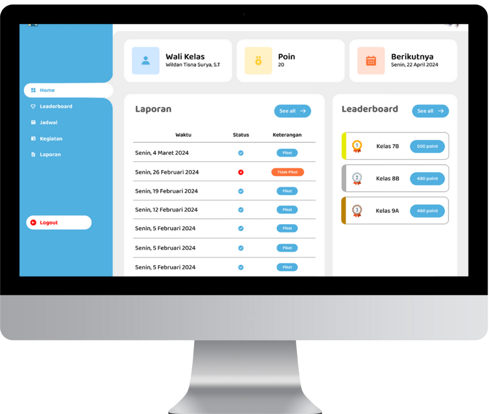
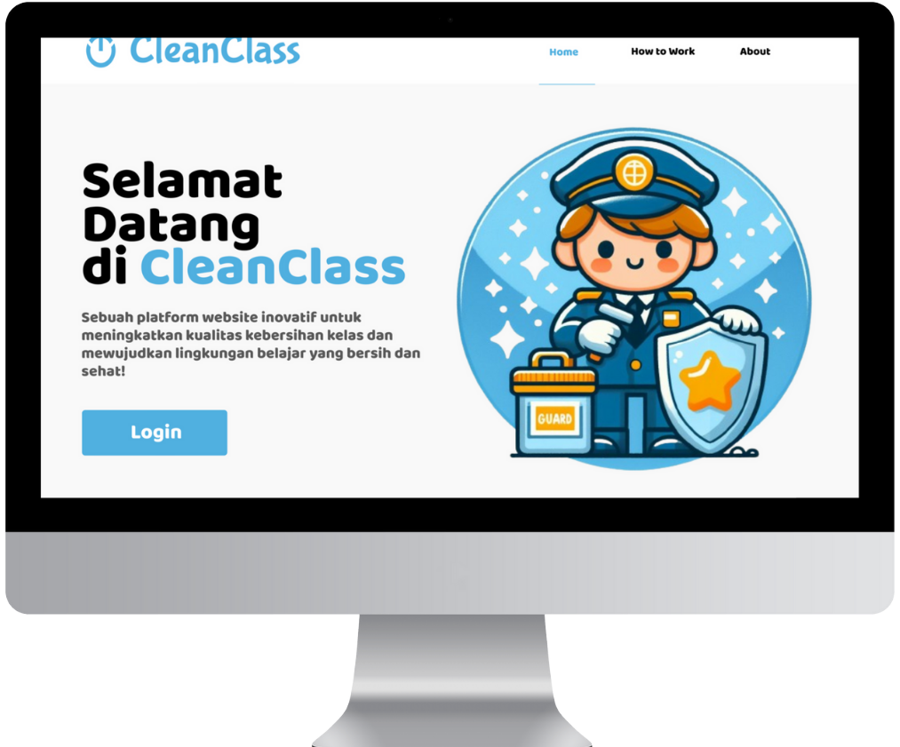

# 🧹 CleanClass - Smart Class Cleaning Schedule

<div style="display: flex; justify-content: space-between;align-items: center; margin: 20px 0;">
  
  
</div>

## 🌟 Overview

CleanClass is a comprehensive web-based cleaning schedule management system built with Laravel 10 and Bootstrap. It simplifies the process of organizing and managing classroom cleaning duties, ensuring a clean and organized learning environment.

## ✨ Features

### 📅 Schedule Management

-   Interactive cleaning schedule calendar
-   Automatic rotation system
-   Task assignment and tracking
-   Schedule conflict detection

### 👥 User Management

-   Multi-role support (Admin, Teacher, Student)
-   Group/Class management
-   Attendance tracking
-   Performance metrics

### 📊 Dashboard

-   Schedule overview
-   Task completion statistics
-   Recent activities feed
-   Performance reports

### 🔔 Notifications

-   Schedule reminders
-   Task completion alerts
-   Schedule changes notifications
-   Absence notifications

## 🛠️ Tech Stack

### Frontend

-   Bootstrap 5
-   jQuery
-   SASS
-   Font Awesome Icons

### Backend

-   Laravel 10
-   MySQL/MariaDB
-   PHP 8.1+

## ⚙️ System Requirements

-   PHP >= 8.1
-   Composer
-   MySQL >= 5.7 or MariaDB >= 10.3

## 📦 Installation

```bash
# Clone the repository
git clone https://github.com/Wilimaxs/cleanclas.git

# Navigate to project directory
cd cleanclass

# Install PHP dependencies
composer install

# Install NPM dependencies
npm install

# Copy environment file
cp .env.example .env

# Generate application key
php artisan key:generate

# Run database migrations
php artisan migrate

# Seed the database (optional)
php artisan db:seed

# Compile assets
npm run dev

# Start the development server
php artisan serve
```

## 🔧 Configuration

### Environment Variables

```env
APP_NAME=CleanClass
APP_ENV=local
APP_KEY=
APP_DEBUG=true
APP_URL=http://localhost

DB_CONNECTION=mysql
DB_HOST=127.0.0.1
DB_PORT=3306
DB_DATABASE=cleanclass
DB_USERNAME=root
DB_PASSWORD=
```

## 🚀 Features Implementation

### User Roles & Permissions

-   **Admin**: Full system access
-   **Teacher**: Schedule management, reports access
-   **Student**: View schedule, mark tasks complete

## 📱 Responsive Design

CleanClass is built with a mobile-first approach using Bootstrap 5, ensuring:

-   Responsive grid system
-   Touch-friendly interfaces
-   Adaptive layouts
-   Cross-browser compatibility

## 🔒 Security

-   CSRF protection
-   SQL injection protection
-   Input validation
-   Role-based access control
-   Session management

## 🧪 Testing

```bash
# Run PHPUnit tests
php artisan test

# Run specific test suite
php artisan test --filter ScheduleTest
```

## 📧 Support

-   Email: wildan27370@gmail.com
-   Issues: [GitHub Issues](https://github.com/Wilimaxs/cleanclass/issues)

---

Made with ❤️ by Prokon Team
